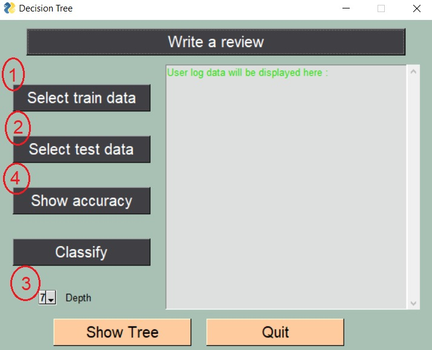
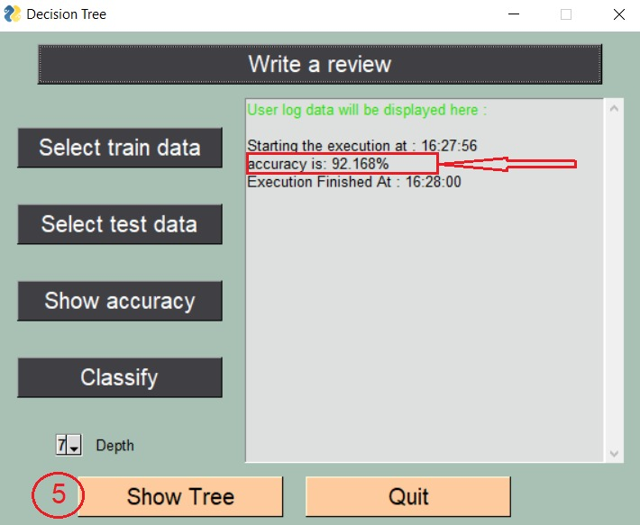
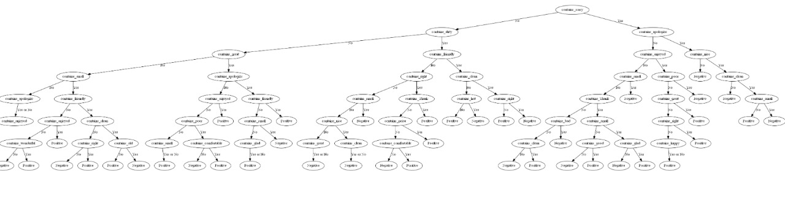
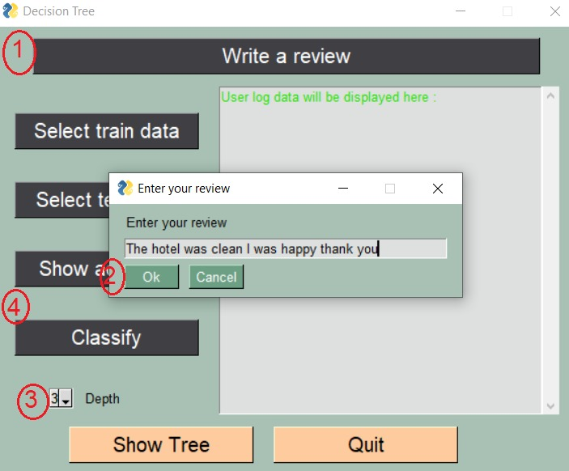
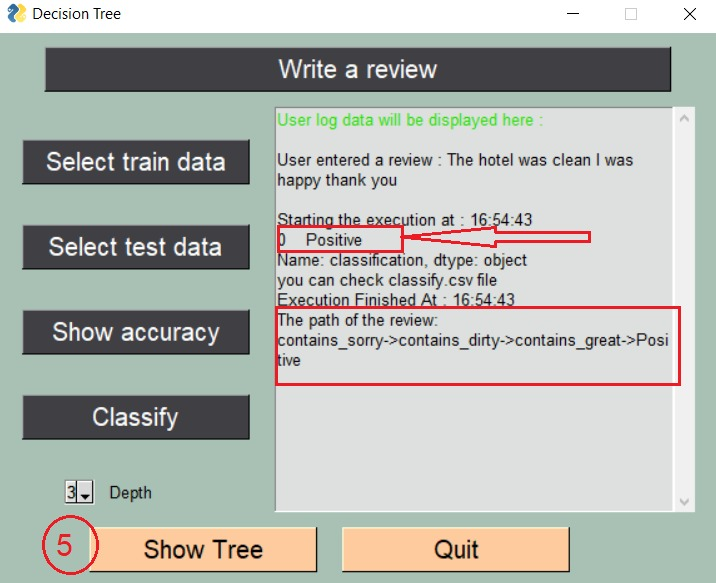
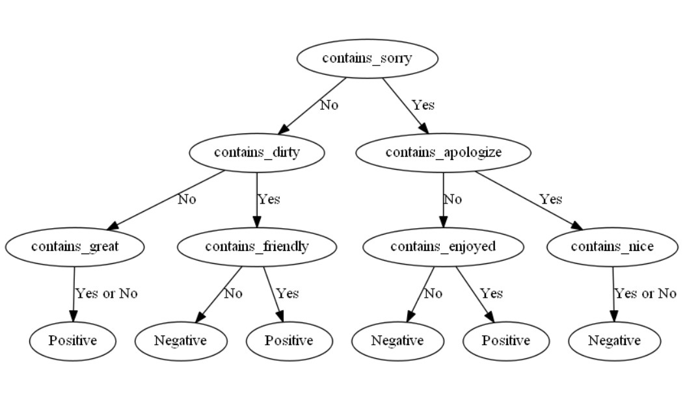

# Decision Tree Algorithm from scratch
This project is a part of our coursework in Data Structure and algorithms course.
Here's the functionalities of our project:
Our project can:
1. Classify any ready csv dataset after training our model
2. Parse raw text and turn it into a csv file to classify it
3. Calculate the accuracy of a pre-known classification dataset
4. Set the depth(constraint in decision tree) of the decision tree
5. Show the trained model of the tree.

And here's our GUI:

